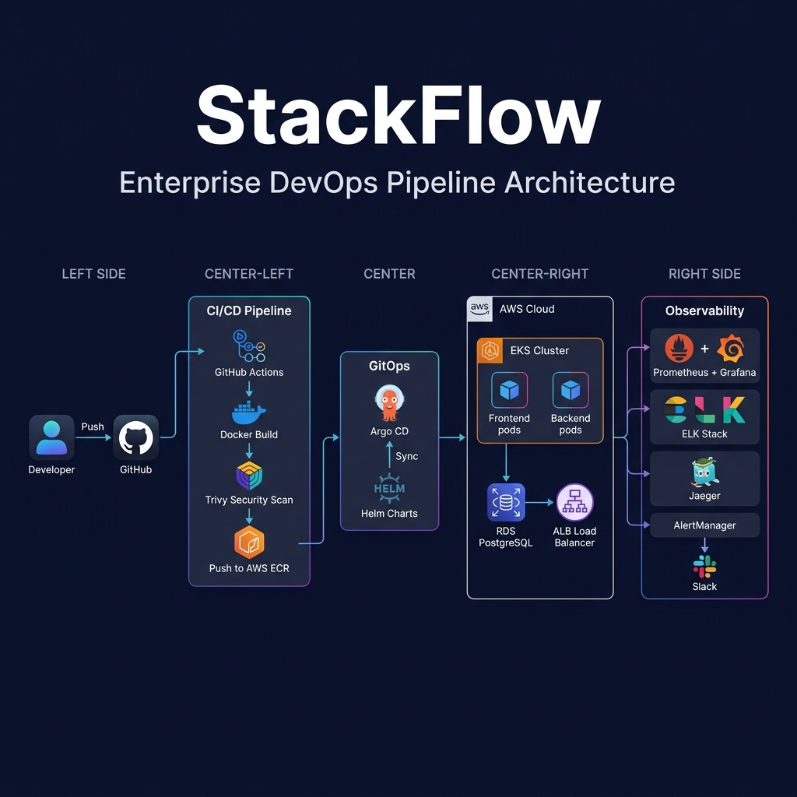

# StackFlow

Enterprise-grade 3-tier DevSecOps pipeline on AWS EKS.



## What is this?

A complete end-to-end DevOps project covering everything from application code to production infrastructure. Built with real-world patterns used in enterprise environments.

**Stack:** React + Node.js + PostgreSQL, running on EKS with GitOps, full observability, and automated security scanning.

## Architecture


```
Developer Push → GitHub Actions → Docker Build → Trivy Scan → ECR Push → Helm Update → Argo CD Sync
```

### Deployment Strategies

| Branch | Environment | Strategy |
|---|---|---|
| `devops` | dev namespace | Direct deploy |
| `test` | test namespace | Canary (20% → 50% → 100%) |
| `main` | prod namespace | Blue-Green with manual promote |

### Observability


| Pillar | Stack |
|---|---|
| Metrics | Backend `/metrics` → Prometheus → Grafana → AlertManager → Slack |
| Logging | Loki + Promtail (replaced ELK to save ~4GB RAM) |
| Tracing | OpenTelemetry SDK → OTel Collector → Jaeger |

## Cost Optimization

This project is designed to run cheap without sacrificing quality.

| Optimization | What we did | Savings |
|---|---|---|
| Spot instances | 70-90% of nodes run on spot | ~70% compute cost |
| Graviton (ARM) | t4g instances instead of t3 | ~20-30% cheaper |
| No NAT Gateway | Nodes in public subnets for dev | ~$32/month |
| Loki over ELK | 192MB RAM vs 4-6GB | ~$80-200/month |
| NGINX Ingress | Replaced ALB Ingress Controller | ~$16/month |
| gp3 storage | RDS and EBS use gp3 over gp2 | ~20% storage cost |
| Night scheduler | CronJob scales down dev/test at 10PM IST | ~40-60% compute |
| Karpenter | Replaces Cluster Autoscaler, auto-consolidates | ~20-30% more |
| Right-sized pods | 50m CPU / 64Mi (not 500m / 512Mi) | eliminates waste |

**Before:** $250-350/month → **After:** $10-25/month

## Quick Start

### Run locally (free)

```bash
git clone https://github.com/Pradeepks01/StackFlow.git
cd StackFlow/docker
docker-compose -f docker-compose.free-tier.yml up -d --build
```

Open:
- Frontend: http://localhost
- Backend: http://localhost:5000/health
- Grafana: http://localhost:3000 (admin/admin)
- Prometheus: http://localhost:9090

### Run on AWS

```bash
cd terraform
export TF_VAR_db_password="YourStrongPassword123"
terraform init
terraform plan
terraform apply
```

Then bootstrap EKS:
```bash
./scripts/eks-bootstrap.sh
kubectl apply -f gitops/apps/dev.yaml
kubectl apply -f gitops/apps/test.yaml
kubectl apply -f gitops/apps/prod.yaml
```

## Project Structure

```
stackflow/
├── app/
│   ├── backend/           # Node.js Express API
│   └── frontend/          # React (Vite) + Nginx
├── database/              # SQL init + seed scripts
├── docker/                # Docker Compose (full, dev, free-tier)
├── terraform/             # VPC, EKS, RDS, ALB, IAM, CloudWatch
├── helm/stackflow/        # Helm chart with env-specific values
├── k8s/
│   ├── namespace.yaml
│   ├── karpenter-provisioner.yaml
│   └── night-scheduler.yaml
├── .github/workflows/     # GitHub Actions CI/CD
├── cicd/jenkins/          # Jenkinsfile + deployment scripts
├── gitops/                # Argo CD app manifests (dev/test/prod)
├── observability/
│   ├── alerting/          # AlertManager + Slack
│   ├── logging/           # Loki + Promtail (lightweight ELK replacement)
│   ├── monitoring/        # Prometheus + Grafana dashboards
│   └── tracing/           # Jaeger + OTel Collector
├── security/
│   ├── trivy/             # Container image scanning
│   ├── snyk/              # Dependency scanning
│   └── opa/               # Admission policies
└── scripts/               # Setup, deploy, cleanup, rollback
```

## Infrastructure

| Resource | Spec |
|---|---|
| VPC | 10.0.0.0/16, 2 AZs, public + private subnets |
| EKS | K8s 1.29, spot + on-demand node groups (Graviton ARM) |
| RDS | PostgreSQL 16.1, gp3, encrypted, Secrets Manager |
| ALB | HTTPS with ACM cert, TLS 1.3, HTTP redirect |
| State | S3 backend + DynamoDB locking |
| Alerts | CloudWatch → SNS → email/Slack |

## Security

| Layer | How |
|---|---|
| Image scanning | Trivy in CI, blocks on HIGH/CRITICAL |
| Secrets | AWS Secrets Manager, no hardcoded passwords |
| IAM | Least-privilege roles, data source lookups |
| Network | Network policies, frontend can't reach DB directly |
| TLS | ACM + ALB with TLS 1.3 |
| Admission | OPA Gatekeeper, enforces runAsNonRoot |
| Encryption | RDS storage encrypted at rest |

## CI/CD Pipeline

Two CI/CD paths available:

**GitHub Actions** (primary)
```
Build → Trivy Scan → Push to ECR → Update Helm values → Argo CD syncs
```

**Jenkins** (alternative)
```
Build → Scan → Push → Branch-based deploy (canary/blue-green)
```

Key point: Trivy scans run **before** push. Vulnerable images never reach ECR.

## Deployment Strategies

### Canary (test branch)
```yaml
strategy:
  canary:
    steps:
      - setWeight: 20
      - pause: { duration: 1h }
      - setWeight: 50
      - pause: { duration: 1h }
```

### Blue-Green (main branch)
```yaml
strategy:
  blueGreen:
    activeService: stackflow-frontend
    previewService: stackflow-frontend-preview
    autoPromotionEnabled: false
```

## Cleanup

```bash
cd terraform
terraform destroy

# or use the script
./scripts/cleanup.sh
```

---

Built by Pradeep
