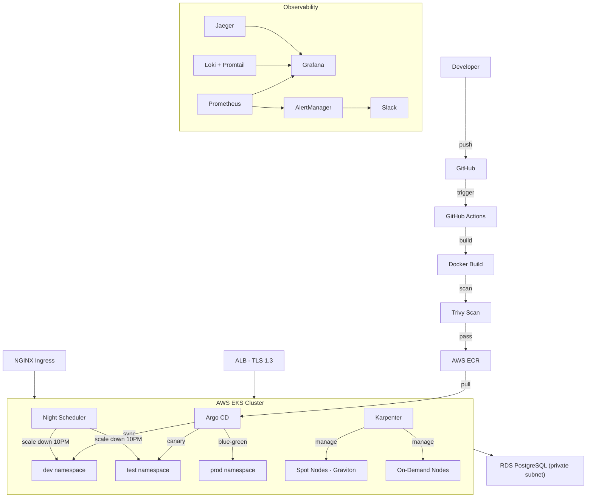
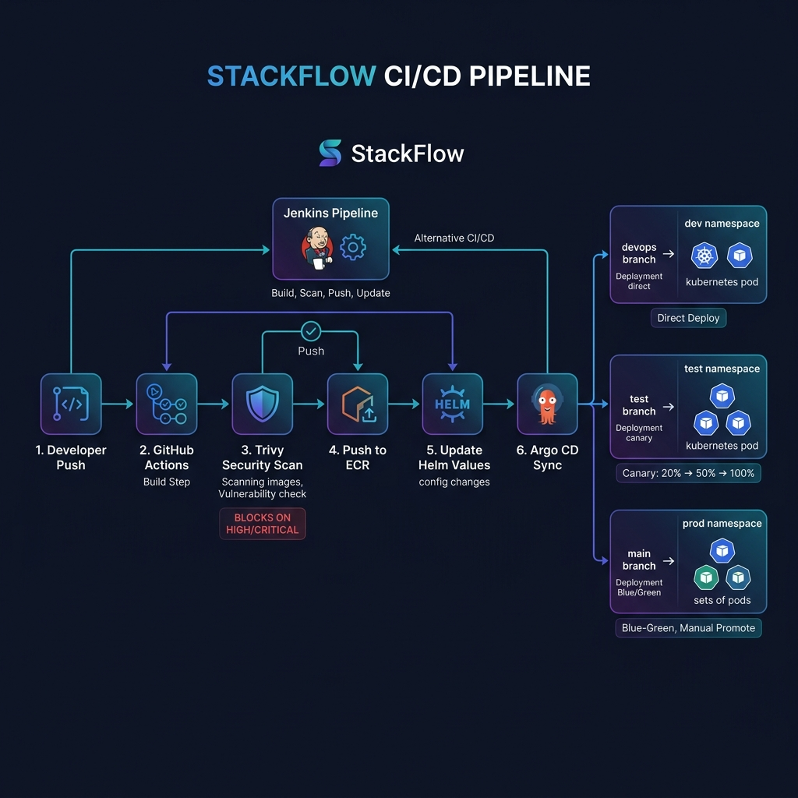
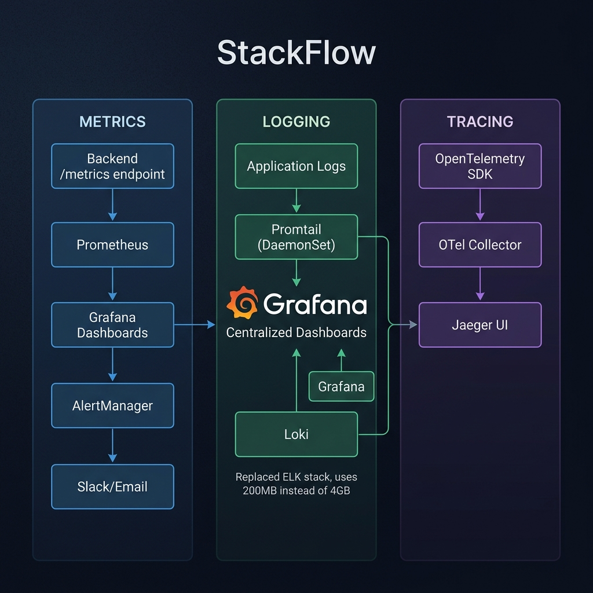

# StackFlow

A 3-tier DevSecOps project running on AWS EKS. Built this to learn and demonstrate end-to-end infrastructure, CI/CD, security scanning, and observability in a real-world setup.

The app itself is simple (React + Node.js + PostgreSQL), but the infra around it is production-grade.

## Architecture



## CI/CD Pipeline



```
push code → GitHub Actions builds → Trivy scans → pushes to ECR → Argo CD syncs to EKS
```

Three environments, three branches:

| Branch | Deploys to | Strategy |
|--------|-----------|----------|
| devops | dev namespace | direct deploy |
| test | test namespace | canary (20→50→100%) |
| main | prod namespace | blue-green |

## Observability



| Pillar | Stack |
|--------|-------|
| Metrics | Backend /metrics → Prometheus → Grafana → AlertManager → Slack |
| Logging | Loki + Promtail (replaced ELK, uses 200mb vs 4gb) |
| Tracing | OpenTelemetry SDK → OTel Collector → Jaeger |

## Tech Stack

- **App:** React (Vite), Node.js/Express, PostgreSQL
- **Infra:** Terraform, AWS (EKS, RDS, ALB, VPC, CloudWatch)
- **CI/CD:** GitHub Actions, Jenkins, Argo CD
- **Containers:** Docker, Helm, Karpenter
- **Security:** Trivy, OPA Gatekeeper, Snyk
- **Observability:** Prometheus, Grafana, Loki, Jaeger, OpenTelemetry

## Run locally

```bash
git clone https://github.com/Pradeepks01/StackFlow.git
cd StackFlow/docker
docker-compose up -d --build
```

Then hit:
- http://localhost (frontend)
- http://localhost:5000/health (backend)
- http://localhost:3000 (grafana, login admin/admin)
- http://localhost:9090 (prometheus)

If you're on a small EC2 (t2.micro), use the lightweight version:
```bash
docker-compose -f docker-compose.free-tier.yml up -d --build
```

## Project layout

```
app/
  backend/       express api with health, metrics, opentelemetry
  frontend/      react app served by nginx

database/
  init.sql       creates users and system_logs tables
  seed.sql       inserts sample data

docker/
  docker-compose.yml            standard (5 services)
  docker-compose.free-tier.yml  fits in 1gb ram
  docker-compose.dev.yml        full stack with elk + jaeger
  prometheus/                   scrape config and alert rules

terraform/
  main.tf        s3 backend, dynamodb lock
  vpc.tf         2 AZs, public + private subnets
  eks.tf         spot nodes (graviton) + on-demand pool
  rds.tf         postgres 16, gp3, secrets manager
  alb.tf         https with acm cert, tls 1.3
  iam.tf         eks roles, data source policy lookups
  cloudwatch.tf  cpu alarm + sns notification

helm/stackflow/
  values.yaml        base values (nginx ingress, right-sized resources)
  values-dev.yaml    debug logging, hpa off
  values-test.yaml   canary config
  values-prod.yaml   blue-green, 4 replicas, strict limits

k8s/
  karpenter-provisioner.yaml   spot-first node scheduling
  night-scheduler.yaml         scales down dev/test at 10pm IST

gitops/apps/
  dev.yaml     argo cd app → devops branch
  test.yaml    argo cd app → test branch
  prod.yaml    argo cd app → main branch

observability/
  logging/     loki + promtail
  monitoring/  grafana dashboards
  tracing/     jaeger + otel collector
  alerting/    alertmanager → slack

security/
  trivy/       image scan config
  opa/         admission policies
  snyk/        dependency scanning

cicd/jenkins/  jenkinsfile + deploy scripts
scripts/       setup, bootstrap, deploy, cleanup
```

## Cost optimization

| What | Why |
|------|-----|
| Spot instances | 70-90% cheaper compute |
| Graviton (ARM) | t4g is 20-30% cheaper than t3 |
| No NAT gateway | saves ~$32/month (dev only) |
| Loki not ELK | 200mb ram vs 4gb |
| gp3 storage | cheaper than gp2, better iops |
| Night scheduler | scales down at 10pm, up at 8am |
| Right-sized pods | 50m cpu / 64mi, not 500m / 512mi |

Rough cost: ~$10-25/month after optimization. Free tier with docker-compose.

## Deploy to AWS

```bash
cd terraform
export TF_VAR_db_password="YourPassword"
terraform init && terraform apply

./scripts/eks-bootstrap.sh
kubectl apply -f gitops/apps/
```

## Security

- Trivy scans before push (blocks HIGH/CRITICAL)
- Docker containers run with `no-new-privileges` and `read_only`
- Secrets in AWS Secrets Manager
- RDS encrypted, private subnet
- TLS 1.3 on ALB
- OPA enforces runAsNonRoot

## Cleanup

```bash
terraform destroy
```

---

Built by Pradeep
